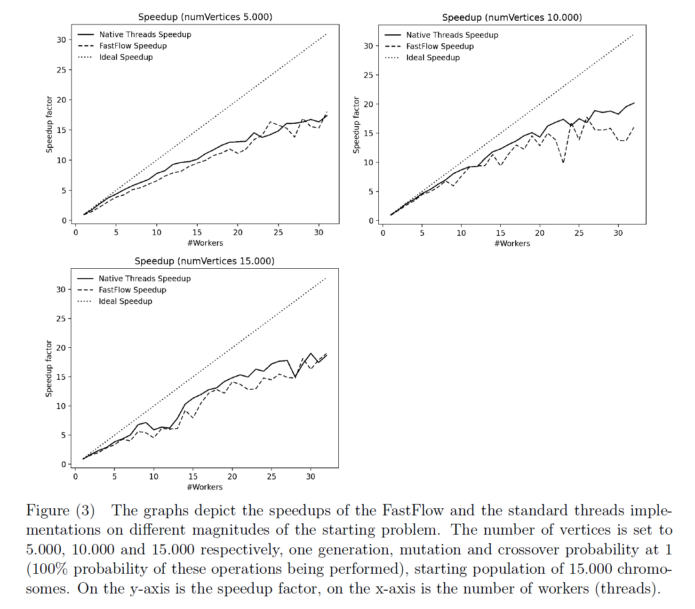
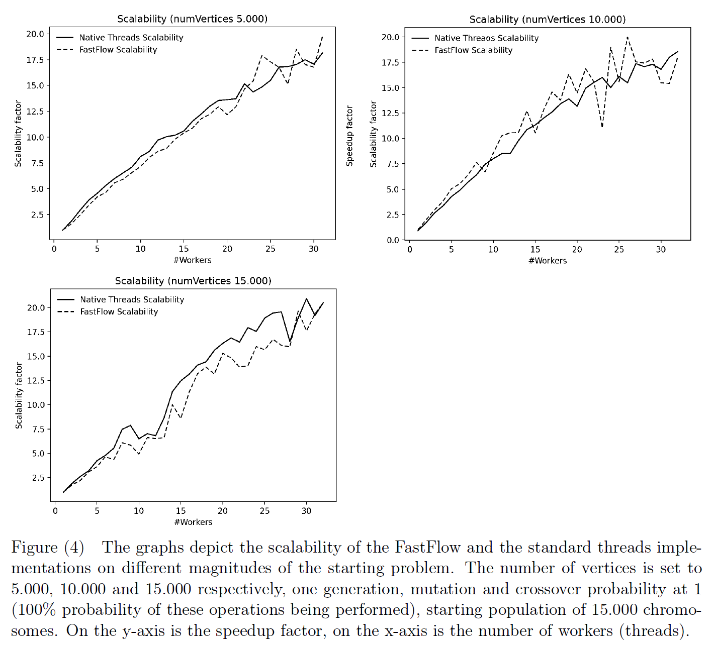

# Prallelization of Genetic Algorithms to solve the Travelling Salesman Problem

Project for the Parallel and Distributed Systems: Paradigms and Models course @ [University of Pisa](https://www.unipi.it/index.php/english)

Authors: [Alberto Marinelli](https://github.com/AlbertoMarinelli)

## Abstract
This project focuses on parallelization of a **genetic algorithm** to solve the **Travelling Salesman Problem (TSP)**. A sequential version is developed, followed by an analysis to identify components suitable for parallelization. Two parallel implementations are created using **standard threads** and **FastFlow**. Subsequently, the performance gains from parallelization are evaluated and the sequential and parallel versions are compared using metrics such as execution time and solution quality. The results provide insights into the benefits and tradeoffs of standard threads and FastFlow, showing how the field of parallel optimization algorithms is used to efficiently solve complex combinatorial problems.

  

## Main results
As shown in the initial analysis, the most interesting phases for the parallelization operations turned out to be the initial generation phase, the evaluation and the crossover PMX. The main result of the parallelization of these phases has been a reduction in computation times of about **18x** compared to the sequential version. Below are the graphs for evaluating the **speedup** and **scalability** of the two parallel versions.
  

## Languages and Tools

  

